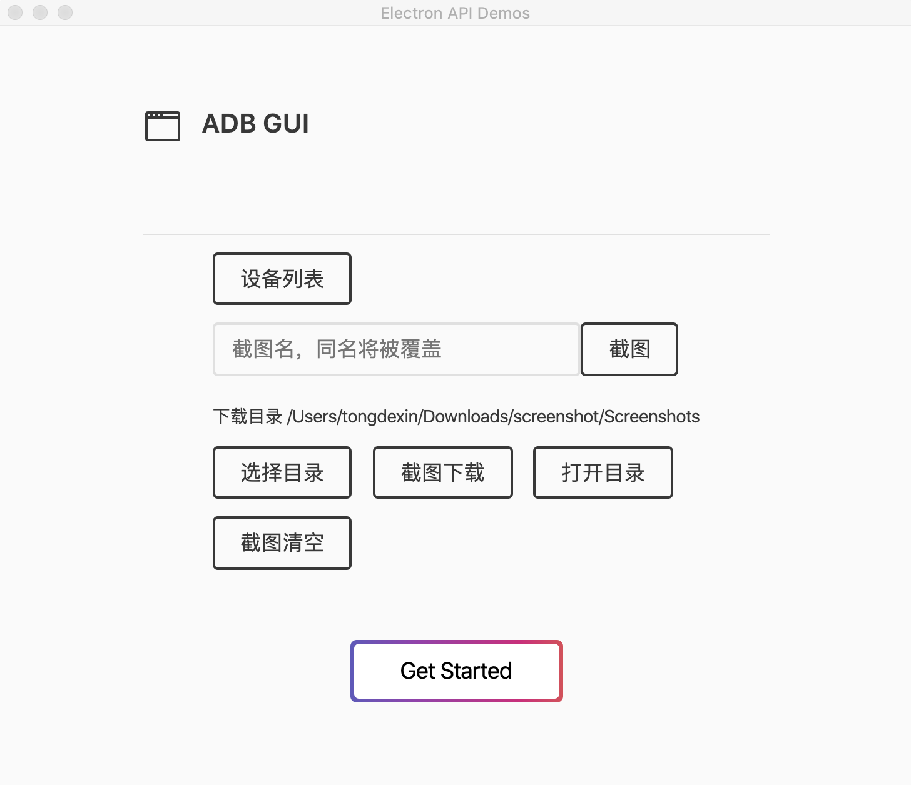

# ~~ADBGUI~~

 **Attention**: This tool is now deprecated. Please switch to
[ScreenShotGUI](https://github.com/a120200793/ScreenShotGUI).

没有时间学Electron，最近又要用这个小工具了，用JavaSwing重新写了一个[ScreenShotGUI](https://github.com/a120200793/ScreenShotGUI).。主要就是截图的功能，不敢起ADB Gui这么大的名字。

Electron编写的ADB图形化界面，目前只有截图，并将其下载到本地的功能，支持Mac Windows

因最近有需要大量截图的工作 为了方便自己 所以编写了此项目。功能如图。





## 构建

在构建此应用之前, 你需要安装 [Node.js](https://nodejs.org).

```bash
$ git clone https://github.com/a120200793/ADBGUI.git
$ cd ADBGUI
$ npm install
$ npm start
```

## Base
### 此项目是直接在ElectronDemo中加入了新页面，操作ADB，原项目地址
[electron-api-demos-Zh_CN](https://github.com/demopark/electron-api-demos-Zh_CN)
